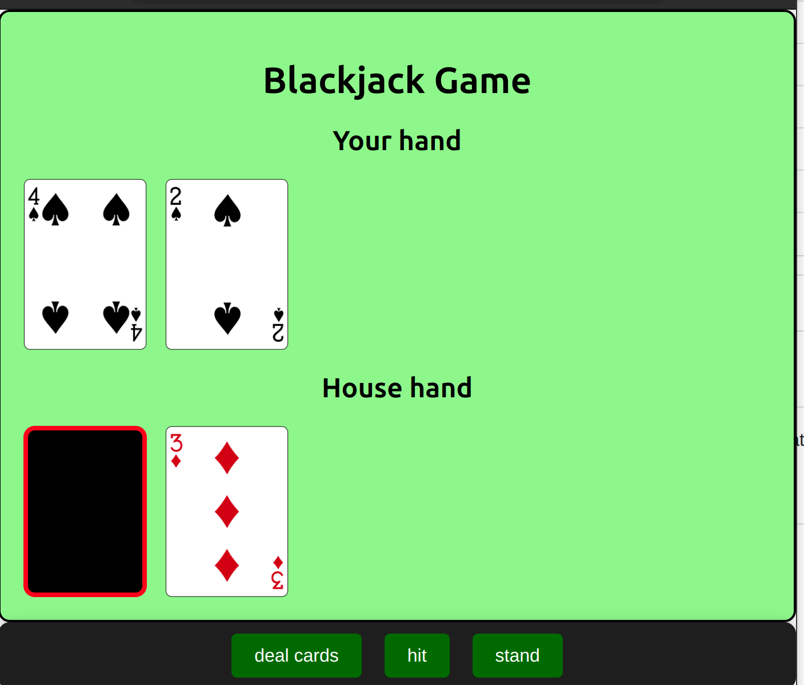

# Blackjack Card Game

This is a simple Blackjack card game implemented in React. Try your luck and see if you can beat the house!

## Getting Started

To get started with the game, follow these instructions:

### Prerequisites

- [Node.js](https://nodejs.org/) and [npm](https://www.npmjs.com/) should be installed on your computer.

### Installation

1. Clone the repository to your local machine:

   ```bash
   git clone https://github.com/your-username/blackjack-card-game.git
   ```

2. Navigate to the project directory:

   ```bash
   cd blackjack-card-game
   ```

3. Install the project dependencies:

   ```bash
   npm install
   ```

### Building

To build the project, run:

```bash
npm run build
```

This will create a production-ready build of the game in the `build` directory.

### Running

To start the game, run:

```bash
npm start
```

This will launch the game in your browser. Have fun playing Blackjack!

